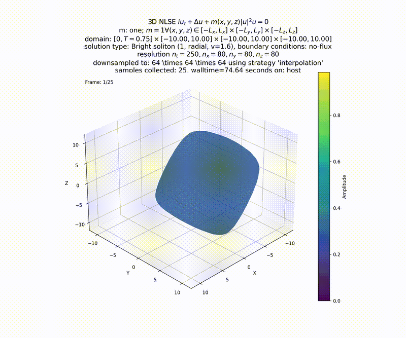

This is going to be a small collection of solvers for
some classes of nonlinear wave equations.

#### NLSE

In generally we look at two-dimensional versions of the nonlinear Schrödinger equation as

$$ i u\_t + \Delta u + V(u; x, y, t) u = 0 $$

The below trajectories show $|u|^2$ with random initial conditions (not fully random, this
will be expanded on at a later point).

#### sine-Gordon

TODO

#### Klein-Gordon

TODO

#### Further work

TODO

